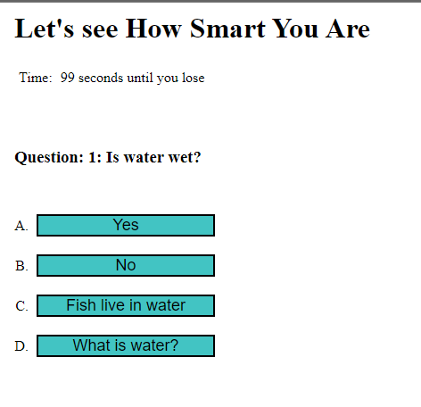

# quiz-site

## Description

This project helped me to think through how to approach a problem and build it out with JavaScript. I utilized for loops, local storage, objects and query selectors to build the site

## Table of Contents (Optional)

N/A

## Installation

Copy and past this URL: https://nmargolis00.github.io/quiz-site/

## Image

## Credits

N/A

## License

MIT License

## Badges

N/A

## Features

Makes you a password!

## How to Contribute

N/A

## Tests

N/A